## 🌟 About me:
Mabel Samuel is a software developer and AI policy actor.
## 📫 How to reach me: 
mapleberrysamuel@gmail.com.
## ⚡ Fun fact: 
I would rather read the documentation than watch a video 😅.
## 🔥 My stats:

<!-- 

  

-->

<!---
  
--->
 

<!---
MabelSamuel/MabelSamuel is a ✨ special ✨ repository because its `README.md` (this file) appears on your GitHub profile.
You can click the Preview link to take a look at your changes.
--->
